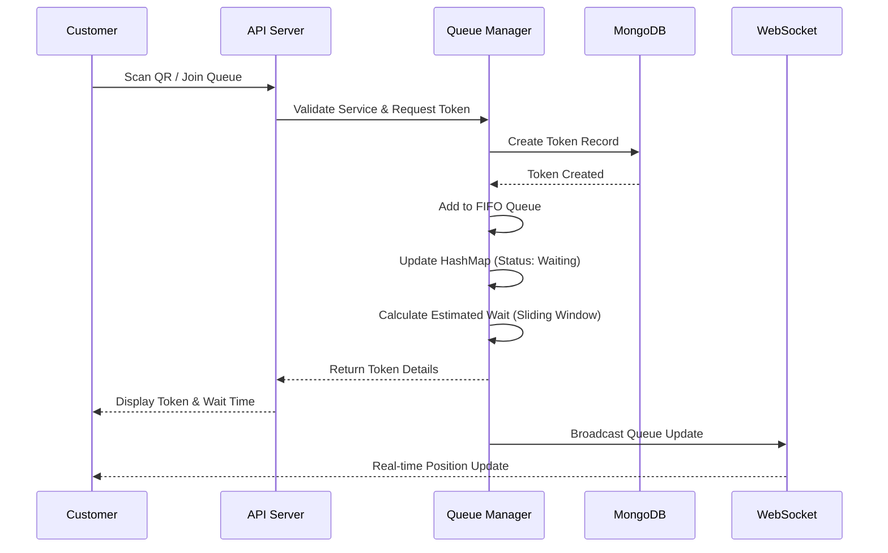
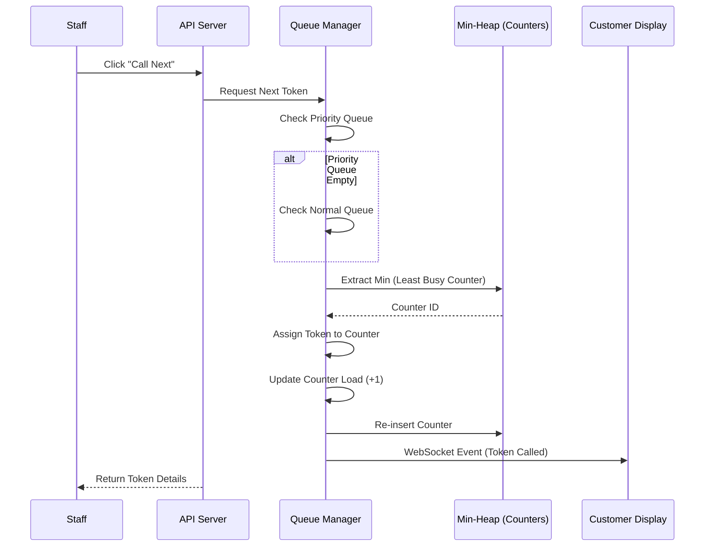

# Project Diagrams

These diagrams visualize the architecture and data flow of the LineLess application. You can view these diagrams directly in VS Code (with a Mermaid extension) or copy the code blocks into [Mermaid Live Editor](https://mermaid.live/).

## 1. High-Level System Architecture

```mermaid
graph TD
    subgraph Client_Layer [Client Layer]
        C[Customer Interface<br/>(Mobile/Web)]
        A[Admin Dashboard<br/>(Desktop)]
        S[Staff Panel<br/>(Tablet/Desktop)]
    end

    subgraph Server_Layer [Server Layer]
        API[Express.js API]
        WS[WebSocket Server<br/>(Socket.IO)]
        QM[Queue Manager<br/>(DSA Orchestrator)]
    end

    subgraph Database_Layer [Database Layer]
        DB[(MongoDB)]
    end

    C <-->|HTTP/WebSocket| API
    A <-->|HTTP/WebSocket| API
    S <-->|HTTP/WebSocket| API

    API <--> QM
    WS <--> QM

    QM <--> DB
```

## 2. DSA Component Architecture (Queue Management)

This diagram shows how different Data Structures are used to manage the queue efficiently.

```mermaid
graph TD
    subgraph Inputs
        PQ[Priority Queue<br/>(FIFO)]
        NQ[Normal Queue<br/>(FIFO)]
    end

    subgraph Processing [Token Processing]
        TD{Token Dequeue}
        
        subgraph Load_Balancing [Load Balancing]
            MH[Min-Heap<br/>(Counter Loads)]
        end
        
        Assign[Assign Token<br/>to Counter]
    end

    subgraph State_Management [State Management]
        HM[HashMap<br/>(Token State O(1))]
        SW[Sliding Window<br/>(Wait Time Prediction)]
        DQ[Deque<br/>(Skipped/No-Show)]
    end

    PQ --> TD
    NQ --> TD
    TD --> Assign
    MH -->|Extract Min| Assign
    Assign --> HM
    Assign --> SW
    Assign -->|Update Load| MH

    style PQ fill:#e1f5fe,stroke:#01579b
    style NQ fill:#e1f5fe,stroke:#01579b
    style MH fill:#fff3e0,stroke:#e65100
    style HM fill:#f3e5f5,stroke:#4a148c
    style SW fill:#e8f5e9,stroke:#1b5e20
    style DQ fill:#ffebee,stroke:#b71c1c
```

## 3. Customer Join Flow



## 4. Call Next Token Flow



## 5. Analytics & Dashboard Data Flow

This diagram illustrates how data is aggregated for the Analytics Dashboard.

```mermaid
graph TD
    subgraph Frontend
        D[Analytics Dashboard]
    end

    subgraph Backend_API
        EP[GET /api/analytics]
    end

    subgraph Data_Aggregation [Data Aggregation]
        Q1[Total Tokens<br/>(Count)]
        Q2[Avg Wait Time<br/>(Average)]
        Q3[Served vs Skipped<br/>(Group By Status)]
        Q4[Peak Hours<br/>(Time Series)]
    end

    subgraph Database
        Tokens[(Tokens Collection)]
        History[(History Collection)]
    end

    D -->|Request Data| EP
    EP -->|Query| Q1
    EP -->|Query| Q2
    EP -->|Query| Q3
    EP -->|Query| Q4

    Q1 --> Tokens
    Q2 --> History
    Q3 --> Tokens
    Q4 --> History

    Tokens -->|Raw Data| Q1
    History -->|Wait Times| Q2
    Tokens -->|Status Data| Q3
    History -->|Time Stamps| Q4

    Q1 -->|Result| EP
    Q2 -->|Result| EP
    Q3 -->|Result| EP
    Q4 -->|Result| EP

    EP -->|JSON Response| D

    style D fill:#e3f2fd,stroke:#1565c0
    style EP fill:#fff8e1,stroke:#fbc02d
    style Tokens fill:#f3e5f5,stroke:#7b1fa2
    style History fill:#f3e5f5,stroke:#7b1fa2
```

## 6. Comprehensive Multi-Queue System & 6-DSA Interaction

This master diagram illustrates the complete lifecycle of a customer in the system and explicitly labels where each of the **6 Key DSA Algorithms** is utilized.

```mermaid
graph TD
    %% Nodes
    Start((Customer Joins))
    
    subgraph Enrollment [Step 1: Enrollment & Estimation]
        direction TB
        CalcWait[Calculate Wait Time<br/><b>5. Sliding Window Algorithm</b>]
        SetStatus[Set Status: 'Waiting'<br/><b>4. HashMap (O(1) Access)</b>]
    end

    subgraph MultiQueue [Step 2: Multi-Level Queue Management]
        direction TB
        IsPriority{Is Priority?}
        PQ[Priority Queue<br/><b>1. Priority Queue (Heap)</b>]
        NQ[Normal Queue<br/><b>2. FIFO Queue</b>]
    end
    
    subgraph Dispatch [Step 3: Dispatch & Load Balancing]
        direction TB
        CallNext[Staff Calls Next]
        SelectQ{Scheduling Logic:<br/>Check Priority First}
        UsersWaiting[Get Next Token]
        SelectCounter[Select Least Busy Counter<br/><b>3. Min-Heap (Load Balancer)</b>]
    end

    subgraph Service_Lifecycle [Step 4: Service & Exception Handling]
        direction TB
        Serving[Status: 'Serving']
        Outcome{Outcome?}
        Completed((Completed))
        Skipped[Move to Skipped List<br/><b>6. Deque (Push Back)</b>]
        Recall[Recall Customer<br/><b>6. Deque (Pop Front)</b>]
    end

    %% Edge Connections
    Start --> IsPriority
    Start -.-> CalcWait
    Start -.-> SetStatus
    
    IsPriority -- Yes --> PQ
    IsPriority -- No --> NQ
    
    CallNext --> SelectQ
    SelectQ -- Priority Has Data --> PQ
    SelectQ -- Priority Empty --> NQ
    
    PQ --> UsersWaiting
    NQ --> UsersWaiting
    
    UsersWaiting --> SelectCounter
    SelectCounter --> Serving
    
    Serving --> Outcome
    Outcome -- Success --> Completed
    Outcome -- No Show --> Skipped
    Skipped -.-> Recall
    Recall -.-> Serving

    %% Styling for visual distinction
    linkStyle default interpolate basis
    
    style PQ fill:#ffccbc,stroke:#bf360c,stroke-width:2px
    style NQ fill:#b3e5fc,stroke:#01579b,stroke-width:2px
    style SelectCounter fill:#fff9c4,stroke:#fbc02d,stroke-width:2px
    style SetStatus fill:#e1bee7,stroke:#4a148c,stroke-width:2px
    style CalcWait fill:#c8e6c9,stroke:#1b5e20,stroke-width:2px
    style Skipped fill:#ffcdd2,stroke:#b71c1c,stroke-width:2px
    style Recall fill:#ffcdd2,stroke:#b71c1c,stroke-width:2px
```

### Explanation of the 6 Algorithms

1.  **Priority Queue**: Handles VIP/Emergency cases. Ensures they are served before standard customers.
2.  **FIFO Queue**: Managing the `Normal Queue` ensures fairness (First-Come, First-Served) for standard customers.
3.  **Min-Heap**: Used to instantly identify which counter has the minimum load, ensuring efficient load balancing across staff.
4.  **HashMap**: Provides O(1) constant time access to check or update a token's status (Waiting/Serving) without searching the whole list.
5.  **Sliding Window**: Calculates dynamic average wait times based on the last N customers served, providing accurate predictions.
6.  **Deque (Double-Ended Queue)**: Manages skipped tokens. Allows customers to be re-inserted at the front (if they return quickly) or back (if they are delayed), offering flexibility.

## 7. Reordering-Based Method (SJF with Binary Heap)

This diagram illustrates the Reordering-Based approach using a **Priority Queue (Binary Heap)**. Short tasks (or VIPs) receive a **Higher Score** and are inserted into the heap. The process shows how a new "Short Task" physically **overtakes** existing "Long Tasks" by bubbling to the top of the priority structure, causing starvation for low-score items at the bottom.

```mermaid
graph TD
    subgraph Input [Step 1: Metric Analysis]
        direction TB
        TaskA[Task A<br/>Time: 15m]
        TaskB[<b>New Task B</b><br/>Time: 2m]
        
        CalcA[Score = 1/15 = <b>Low (6)</b>]
        CalcB[Score = 1/2 = <b>High (50)</b>]
        
        TaskA --> CalcA
        TaskB --> CalcB
    end

    subgraph Heap_Logic [Step 2: Priority Queue (Binary Heap)]
        direction TB
        
        %% Initial State Logic
        Root((Current Root<br/>Score: 20))
        Child1((Node X<br/>Score: 10))
        Child2((Node Y<br/>Score: 5))
        
        Root --> Child1
        Root --> Child2
        
        %% Insertion Action
        Insert[Insert New Task B (50)]
        Compare{Compare Scorse<br/>50 > 20?}
        Swap[<b>OVERTAKE / SWAP</b><br/>Task B becomes Root]
        
        Insert --> Compare
        Compare -- Yes (Higher Priority) --> Swap
    end

    subgraph Outcome [Step 3: Service Execution Order]
        direction TB
        Ord1[<b>1st: Task B (2m)</b>]
        Ord2[2nd: Previous Root]
        Ord3[Last: Task A (15m)<br/><i>(Starved)</i>]
        
        Swap --> Ord1
        Ord1 --> Ord2
        Ord2 -.-> Ord3
    end

    CalcB --> Insert
    
    style TaskB fill:#4caf50,stroke:#1b5e20,color:white
    style CalcB fill:#4caf50,stroke:#1b5e20,color:white
    style Ord1 fill:#4caf50,stroke:#1b5e20,color:white
    style Ord3 fill:#ffcdd2,stroke:#b71c1c,color:black,stroke-dasharray: 5 5
```
