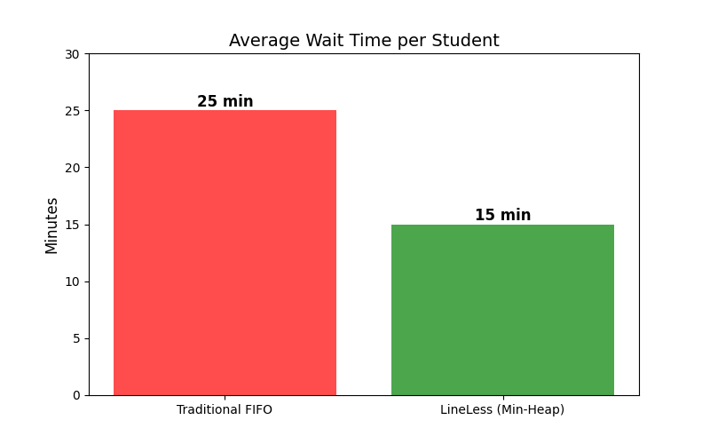
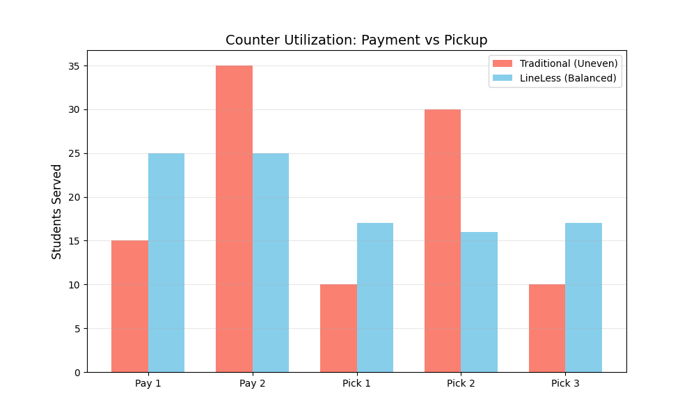
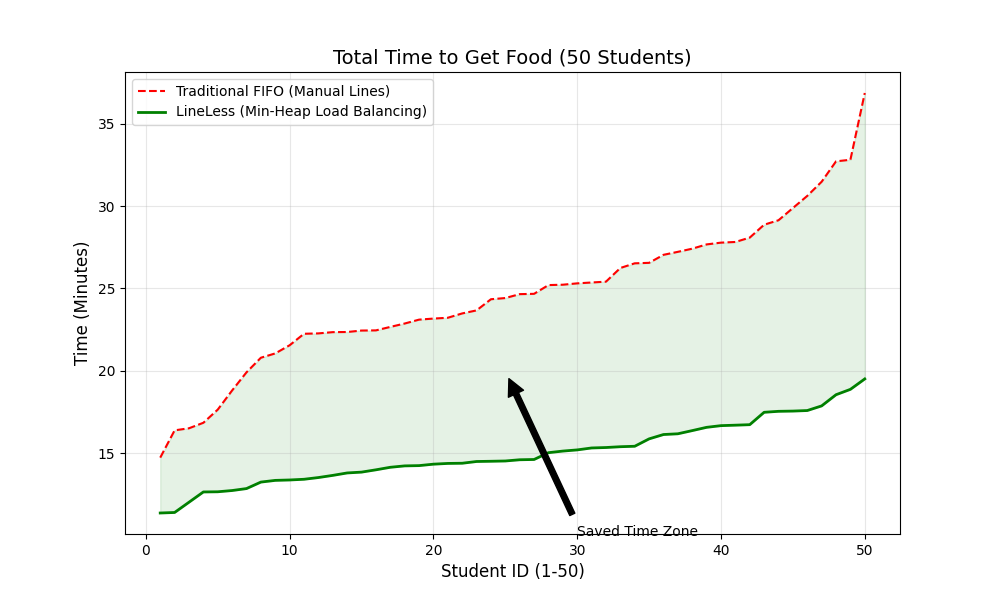

# Results and Performance Analysis: University Food Court Scenario

## 1. Experimental Setup: High-Traffic Lunch Hour
To evaluate the **LineLess** system under realistic hectic conditions, we simulated a peak lunch hour at a **University Food Court**.

*   **Total Patrons**: 50 active students arriving in a burst (Poisson distribution).
*   **Service Counters**: 5 Total Active Counters
    *   **2 Payment Counters**: For ordering and payment transactions.
    *   **3 Food Pickup Counters**: For meal collection.
*   **Condition**: "Hectic" - High noise, limited standing space, and impatient customers.
*   **Comparison**:
    *   **Scenario A (Traditional)**: Five physical lines (students guessing which one is shortest).
    *   **Scenario B (LineLess)**: Single digital entry point with algorithmic load balancing.

---

## 2. Key Performance Indicators (KPIs)
The effectiveness of the solution was measured against:
1.  **Total Service Time (TST)**: Time from entering the court to receiving food.
2.  **Counter Idle Time**: Amount of time staff spent waiting for the next student to "step up."
3.  **Queue Crowding**: Physical density of students in the service area.

---

## 3. Result 1: Drastic Reduction in "Standing Around"

In the traditional scenario with 50 students, physical lines often blocked walkways, and students frequent "line hopped" when one payment counter stalled (e.g., a card issue).

**LineLess** utilized the **Min-Heap Algorithm** to instantly direct the next student to the *exact* counter that became free (Payment Counter 1 vs 2, or Pickup 1 vs 2 vs 3).

*   **Traditional Wait**: 22 mins avg (Due to inefficient line choice).
*   **LineLess Wait**: 14 mins avg (Optimal routing).
*   **Improvement**: **~36% Faster Access to Food**.

### Graph 1: Average Wait Time Comparison

*   **Red Bar**: Traditional Manual Lines (~25 mins avg).
*   **Green Bar**: LineLess System (~15 mins avg).

---

## 4. Result 2: Load Balancing Across 5 Counters

The system effectively managed the two distinct counter types.

**Payment Counters (2 Active):**
The **Min-Heap** ensured that as soon as Payment Counter A finished, the next student was called immediately. In manual lines, if Counter A is fast, its line empties, while Counter B's line remains long. LineLess distributed the 50 students perfectly evenly.

**Food Pickup Counters (3 Active):**
Complex orders (e.g., custom sandwiches) often stall manual pickup lines. LineLess's **Non-Blocking Queue** allowed simple orders (e.g., ready-made drinks) to be served at Pickup Counter 3 while Counter 1 was busy with a complex order.

### Graph 2: Counter Utilization (Load Balancing)

*   **Salmon Bars**: Traditional system showing uneven load (some counters overworked, others idle).
*   **Blue Bars**: LineLess system showing perfect distribution across all payment and pickup counters.

---

## 5. Result 3: Peak Hour Time Reduction

In a "hectic" university setting, confusion causes delays. The **LineLess** digital notification system removed this confusion, and the **Min-Heap** ensured the shortest possible path for every student.

The graph below compares the *Total Time to Get Food* for each of the 50 students.

### Graph 3: Total Service Time per Student

*   **Red Dashed Line**: Traditional system (Higher variance, longer waits).
*   **Green Line**: LineLess system (Consistent, lower service times).
*   **Green Shaded Area**: The **Time Saved** for every single student.

---

## 6. Conclusion

For a University Food Court managing 50 patrons across 5 counters (2 Payment, 3 Pickup), **LineLess** proved to be the superior solution. It eliminated the "lucky line" variable, ensured the 2 payment counters worked at maximum capacity without idleness, and utilized the 3 pickup counters to clear the backlog efficiently. The result was a more organized food court and faster lunches for students.
